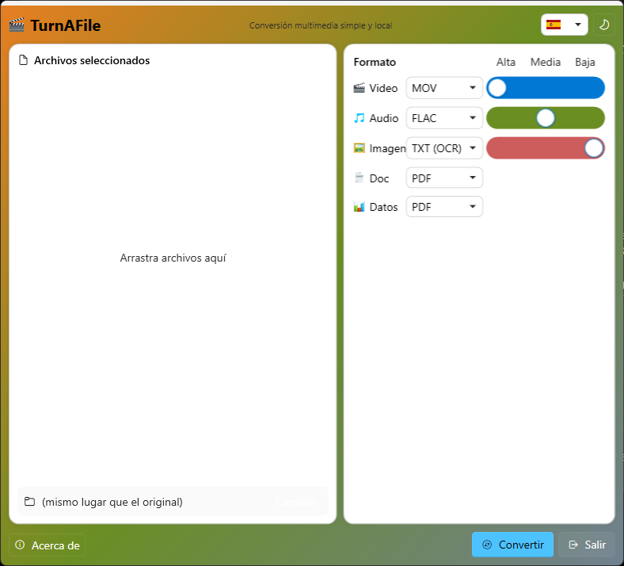
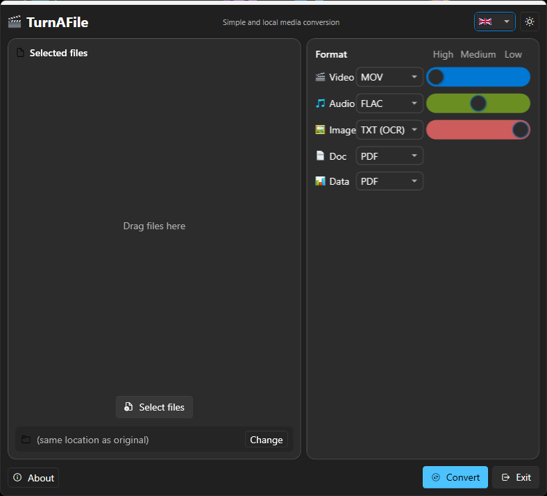
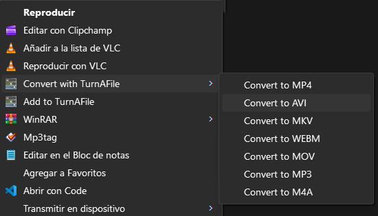
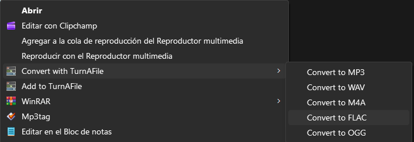
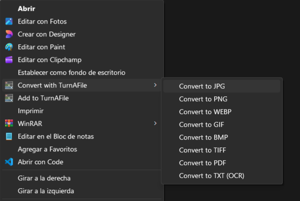
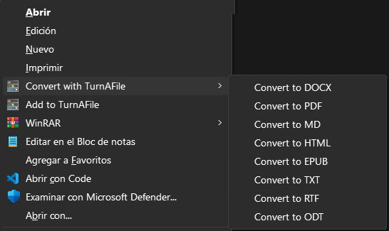
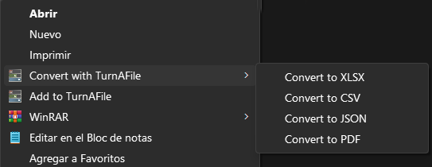

# TurnAFile

> Convertidor multimedia y documental todo-en-uno para Windows.
> Convierte video, audio, imágenes, documentos y datos — sin complicaciones.

---

## ✨ Características

### 🎬 Conversión de Video
| Entrada | Formatos de Salida |
|--------|---------------|
| MP4, AVI, MKV, WEBM, MOV, WMV, FLV | MP4, AVI, MKV, WEBM, MOV, **MP3**, **M4A** |

- Convertir entre formatos de video
- Extraer audio de video (MP3, M4A)
- Calidad ajustable: Alta / Media / Baja
- Conversión por lotes

### 🎵 Conversión de Audio
| Entrada | Formatos de Salida |
|--------|---------------|
| MP3, WAV, M4A, FLAC, OGG, AAC, WMA | MP3, WAV, M4A, FLAC, OGG |

- Convertir entre formatos de audio
- Calidad ajustable: Alta / Media / Baja

### 🖼️ Conversión de Imagen
| Entrada | Formatos de Salida |
|--------|---------------|
| JPG, JPEG, PNG, WEBP, GIF, BMP, TIFF | JPG, PNG, WEBP, GIF, BMP, TIFF, **PDF**, **TXT (OCR)** |

- Redimensionar con calidad ajustable (Original / 75% / 50%)
- Imagen a PDF
- **OCR**: Reconocimiento óptico de caracteres a TXT

### 📄 Conversión de Documentos
| Entrada | Formatos de Salida |
|--------|---------------|
| DOCX | DOCX, PDF, TXT, MD, HTML, EPUB |
| TXT | TXT, DOCX, HTML, **PDF** |
| HTML / HTM | HTML, DOCX, TXT, **PDF** |
| MD / Markdown | MD, DOCX, HTML, TXT |
| RTF | TXT, DOCX |
| ODT | TXT |
| PDF | TXT, DOCX, HTML, EPUB, MD |
| EPUB | TXT, HTML, EPUB, DOCX, PDF, MD |

- Preserva formato en DOCX → PDF (títulos, negrita, cursiva, color, fuente, tablas, imágenes)
- HTML → PDF con resaltado de sintaxis (estilo VS Code)
- EPUB → PDF con contenido estilizado

### 📊 Conversión de Datos
| Entrada | Formatos de Salida |
|--------|---------------|
| XLSX | XLSX, CSV, JSON, **PDF** |
| CSV | CSV, XLSX, JSON, **PDF** |
| JSON | JSON, CSV, XLSX, **PDF** |

- Tablas PDF optimizadas con ajuste de fuente y envoltura de columnas
- Soporte para archivos grandes con columnas anchas

---

## 🔧 Cómo Funciona

### Interfaz
- Ventana única con selector de archivos (arrastrar y soltar)
- Panel lateral para formato y calidad
- Ventana de progreso con cancelación
- Menú contextual de Windows Explorer
- Temas claro y oscuro
- **7 idiomas**: English, Español, Français, Deutsch, 中文 (Chino), 日本語 (Japonés), Portugués (Portugués)

### Donar
- Si TurnAFile te resulta útil, considera [donar](https://www.nocloudware.com/donate.html) para apoyar el desarrollo
- Donaciones vía PayPal — acepta tarjeta de crédito/débito, no requiere cuenta PayPal

### Conversión por Lotes
- Procesar múltiples archivos simultáneamente
- Cada archivo con su propio formato y configuración
- Ventana de progreso con cancelación
- Registro de conversión con resultados

### OCR
- Extraer texto de imágenes usando Tesseract OCR
- Exportar resultados a TXT
- Detecta idioma del sistema automáticamente

---

## 🚀 Instalación
1. Descargar la última versión desde [Releases](https://github.com/nocloudware/TurnAFile/releases)
2. Extraer el ZIP en una carpeta
3. Ejecutar `TurnAFile.exe`

## 📸 Capturas

### Menú Contextual

## 📄 Formatos Soportados

| Entrada | Formatos de Salida |
|--------|---------------|
| MP4, AVI, MKV, WEBM, MOV, WMV, FLV | MP4, AVI, MKV, WEBM, MOV, **MP3**, **M4A** |
| MP3, WAV, M4A, FLAC, OGG, AAC, WMA | MP3, WAV, M4A, FLAC, OGG |
| JPG, JPEG, PNG, WEBP, GIF, BMP, TIFF | JPG, PNG, WEBP, GIF, BMP, TIFF, **PDF**, **TXT (OCR)** |
| DOCX | DOCX, PDF, TXT, MD, HTML, EPUB |
| TXT | TXT, DOCX, HTML, **PDF** |
| HTML / HTM | HTML, DOCX, TXT, **PDF** |
| MD / Markdown | MD, DOCX, HTML, TXT |
| RTF | TXT, DOCX |
| ODT | TXT |
| PDF | TXT, DOCX, HTML, EPUB, MD |
| EPUB | TXT, HTML, EPUB, DOCX, PDF, MD |
| XLSX | XLSX, CSV, JSON, **PDF** |
| CSV | CSV, XLSX, JSON, **PDF** |
| JSON | JSON, CSV, XLSX, **PDF** |

- Preserva formato en DOCX → PDF (títulos, negrita, cursiva, color, fuente, tablas, imágenes)
- HTML → PDF con resaltado de sintaxis (estilo VS Code)
- EPUB → PDF con contenido estilizado
- Tablas PDF optimizadas con ajuste de fuente y envoltura
- Soporte para archivos grandes

---

## 🛠️ Tecnologías

| Componente | Propósito | Licencia |
|-----------|---------|---------|
| **.NET 8.0 WPF** | Marco de aplicación | MIT |
| **FFmpeg** | Conversión video/audio | LGPL/GPL |
| **QuestPDF** | Generación de PDF | MIT Community |
| **Open XML SDK** | Lectura/escritura DOCX | MIT |
| **ClosedXML** | Lectura/escritura XLSX | MIT |
| **Tesseract OCR** | Reconocimiento óptico | Apache 2.0 |
| **PdfPig** | Extracción de texto PDF | Apache 2.0 |
| **WPF-UI** | Controles UI modernos | MIT |

---

## 💚 Donar

Si TurnAFile te ayuda, considera [apoyar el proyecto](https://www.nocloudware.com/donate.html):

- **PayPal** — tarjeta de crédito/débito o cuenta PayPal
- Cada contribución ayuda a mantener la app gratuita y de código abierto

## 📝 Licencia

TurnAFile es software libre bajo la licencia MIT.
Ver [THIRD_PARTY_NOTICES.txt](THIRD_PARTY_NOTICES.txt) para licencias de componentes de terceros.